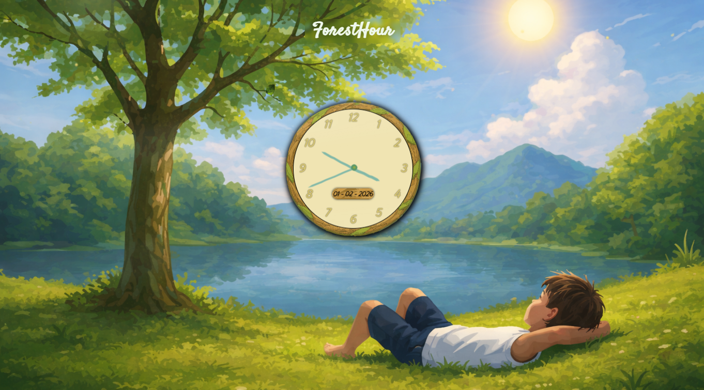

# 🌿 Forest Hour

*A Nature-Inspired Animated Clock*

---

## 📌 Project Overview

**Forest Hour** is a cinematic, nature-themed animated clock built using **only HTML, CSS, and JavaScript**.
The project focuses on blending real-time clock logic with a calm, immersive natural environment, where subtle motion and visual harmony make time feel organic rather than mechanical.

This project was intentionally designed as a **high-quality front-end showcase** to demonstrate advanced layout control, animation techniques, and performance-aware design without relying on any external libraries or frameworks.

---

## 🛠️ Technologies Used

* **HTML5** — semantic structure and layering
* **CSS3** — animations, transforms, positioning, depth, and visual effects
* **JavaScript (Vanilla)** — real-time clock logic and dynamic updates

> ⚠️ No frameworks, libraries, or animation engines were used.

---

## 🎨 Design Approach

The visual design is inspired by calm natural environments such as forests, meadows, and open skies.
The clock is treated as a part of the landscape, not as a separate UI element.

Design priorities:

* Natural color palette
* Soft lighting and shadows
* Balanced composition
* Slow, realistic motion
* Minimal visual noise

Every visual decision was made to maintain **peaceful continuity** rather than attention-grabbing effects.

---

## ⏱️ Clock Implementation (JavaScript)

* The clock uses the system’s real-time data (`Date` object).
* Time is updated continuously with smooth second, minute, and hour hand motion.
* JavaScript calculates rotation angles precisely to avoid visual jitter.
* Animations are synchronized with real time rather than fixed intervals.

This ensures accuracy while maintaining smooth visual flow.

---

## 🎞️ Animation & Motion (CSS)

All animations are implemented using **pure CSS**:

* Grass and environmental movement using keyframes
* Layered parallax effect through transform and depth control
* Smooth transitions using `transform` instead of layout-affecting properties
* GPU-friendly animations to maintain performance

Animation timing is intentionally slow and subtle to mimic real-world motion.

---

## ⚙️ Challenges Faced & Solutions

### 1️⃣ Creating Realistic Motion Without Libraries

**Challenge:**
Achieving natural, non-repetitive movement using only CSS.

**Solution:**
Used multiple layered animations with different durations, delays, and easing functions to avoid uniform motion patterns.

---

### 2️⃣ Synchronizing Clock Accuracy with Smooth Animation

**Challenge:**
Balancing real-time accuracy with visually smooth hand movement.

**Solution:**
Calculated fractional rotations for hour and minute hands using seconds data, ensuring continuous motion rather than step-based movement.

---

### 3️⃣ Performance Optimization

**Challenge:**
Preventing animation lag on lower-end devices.

**Solution:**

* Used `transform` and `opacity` only for animations
* Avoided layout-triggering properties
* Minimized DOM updates

---

### 4️⃣ Visual Balance Between Clock and Background

**Challenge:**
Ensuring the clock stands out without breaking immersion.

**Solution:**
Used contrast control, soft shadows, and scale hierarchy so the clock remains readable while still blending naturally with the scene.

---

## 📱 Responsiveness

* Layout adapts to different screen sizes
* Clock maintains aspect ratio and alignment
* Visual elements scale without distortion

---

## 🎯 Learning Outcomes

* Advanced CSS animation techniques
* Real-time JavaScript calculations
* Performance-aware UI design
* Visual storytelling through motion
* Building polished projects without frameworks

---

## 🚀 Future Enhancements

* Day/Night cycle based on real time
* Seasonal background variations
* Ambient sound toggle
* User-controlled animation intensity

---

## Preview of website



## Link of project :deployed in git 
```https://developeraakashgit.github.io/ForestHour/```

## 🧩 Conclusion

**Forest Hour** demonstrates how thoughtful design and clean code can create immersive experiences using only core web technologies.
It reflects both technical discipline and visual sensitivity, making it a strong portfolio-level front-end project.


